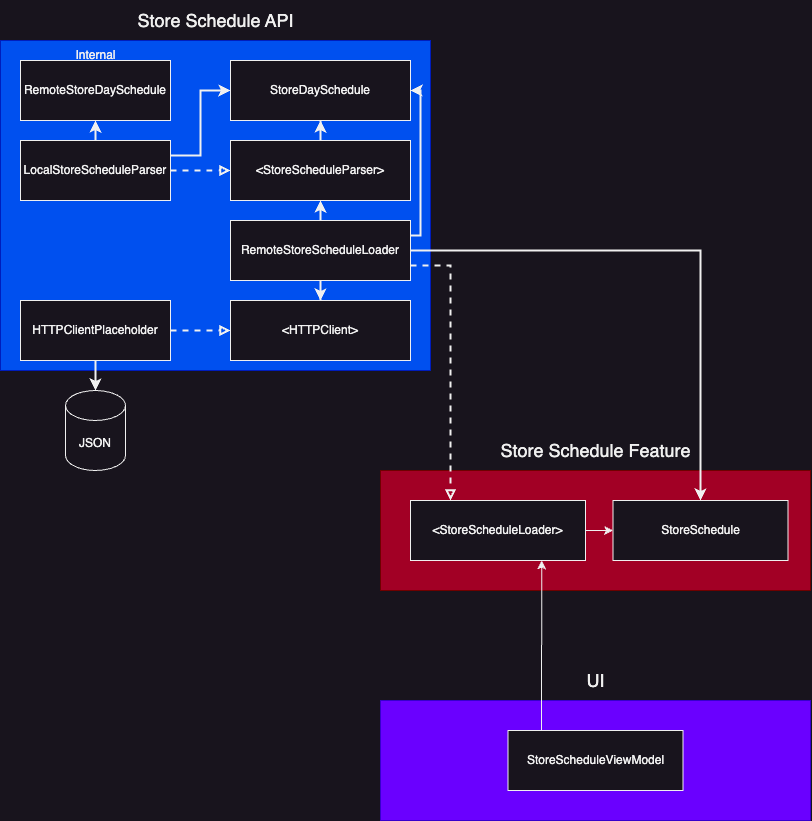

# TDD Practice

### Story: Customer wants to see store hours for the week

#### Narative 1

```
As a customer
I want the app to show me the store hours for each day of the week in a structured way that is easy to understand
So I can know when to shop
```

#### Scenarios (Acceptance criteria)

```
Given the customer finds the store schedule
 When the customer views it
 Then the app should display the days with opening and closing times, grouped for sequentially shared hours.
```

## Use Cases

### Load Store Hours From Remote

#### Data:
- JSON String

#### Display:
- 7 week days, grouped by hours, opening time & closing time.

#### Format
```
Monday-Tuesday    8:00am-11:00pm
Wednesday         9:00am-11:00pm
Thursday-Friday   7:00am-11:00pm
Saturday-Sunday   9:00am-11:00pm
```

#### Primary course (happy path):
1. Execute "Load Store Hours" command with above data.
2. System validates data.
3. System creates a store schedule from valid data.
4. System delivers a display formatted version of the store schedule.

#### Invalid data – error course (sad path):
1. System delivers invalid data error.
2. System displays "" for invalid data.

## Model Specs

### RemoteDaySchedule

| Property      | Type                |
|---------------|---------------------|
| `day`         | `String`            |
| `opens`       | `String`            |
| `closes`      | `String`            |

### Payload contract

```
[
    {
        "day": "MONDAY",
        "opens": "07:00 AM",
        "closes": "11:00 PM"
    },
    {
        "day": "TUESDAY",
        "opens": "07:00 AM",
        "closes": "11:00 PM"
    },
    {
        "day": "WEDNESDAY",
        "opens": "09:00 AM",
        "closes": "11:00 PM"
    },
    {
        "day": "THURSDAY",
        "opens": "07:00 AM",
        "closes": "11:00 PM"
    },
    {
        "day": "FRIDAY",
        "opens": "07:00 AM",
        "closes": "11:00 PM"
    },
    {
        "day": "SATURDAY",
        "opens": "09:00 AM",
        "closes": "11:00 PM"
    },
    {
        "day": "SUNDAY",
        "opens": "09:00 AM",
        "closes": "11:00 PM"
    }
]
```

## App Architecture

